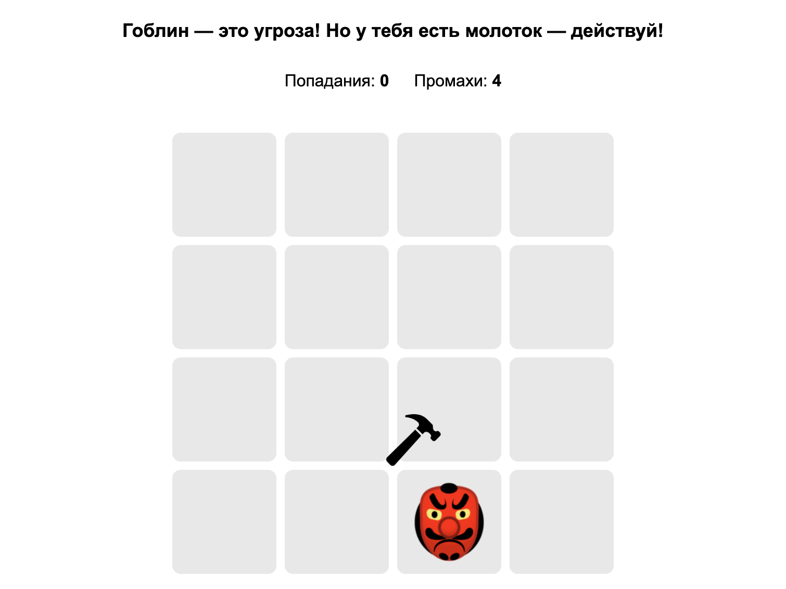
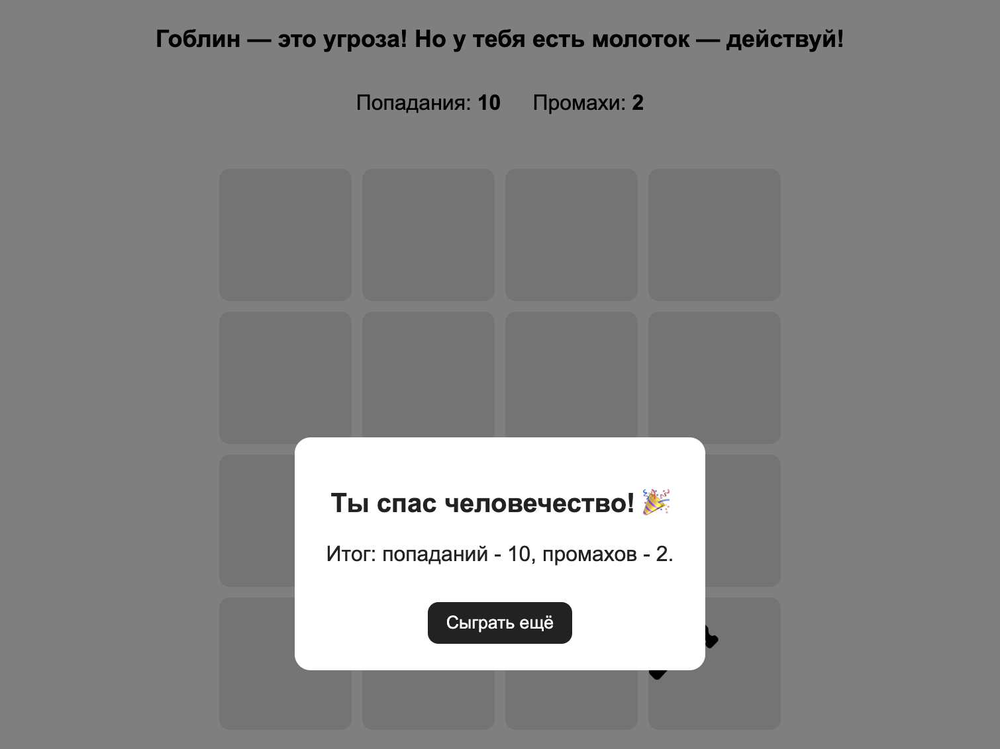
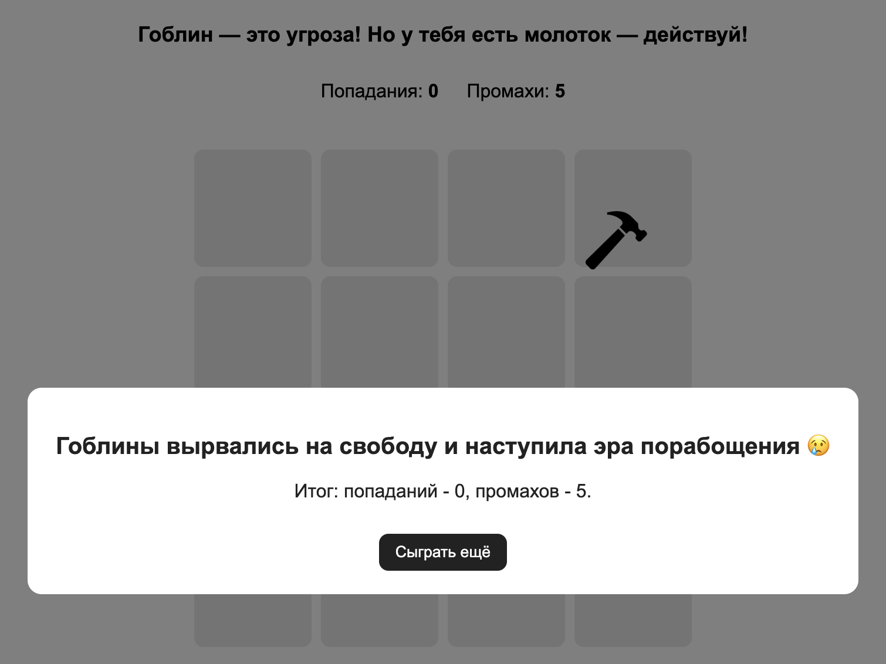

**Игра доступна по адресу:**
👉 [GitHub Pages Demo](https://vikikuk.github.io/goblin-game/)

# 🔨 Goblin Game

Игра в стиле **«Ударь гоблина»**, задача - сразить гоблина молотком, пока он выскакивает из клеток на игровом поле.  

## 🖥️ Визуализация реализованного UI:

<strong>👁️ Посмотреть</strong>

---

## 📜 Описание проекта

В этой версии реализована полноценная игровая логика:

- Генерация поля **4×4** при загрузке страницы.  
- Перемещение гоблина в случайные клетки каждую секунду.  
- Клик по гоблину засчитывает **очко игроку**.  
- Если гоблин выскочил, а клик не последовал - считается **промах**.  
- Игра завершается по условию:  
  - **10 попаданий** → победа 🎉  
  - **5 промахов** → поражение 💀  
- В обоих случаях отображается результат со счётом.  

Дополнительно:
- Реализован **кастомный курсор** в виде молотка.  
- При клике молоток анимируется, создавая эффект удара.  

---

## ⚙️ Технологии проекта

- **Webpack** - сборка проекта  
- **ESLint** - проверка качества кода  
- **Babel** - транспиляция JS  
- **Webpack Dev Server** - локальная разработка  

---

## 🎮 Правила игры

1. Игровое поле размером **4×4** создаётся динамически.  
2. Каждую секунду гоблин появляется в новой случайной клетке.  
3. Твоя задача - кликнуть по гоблину **молотком-курсорoм**.  
4. Условия окончания игры:  
   - 10 попаданий - **победа**  
   - 5 промахов - **поражение**  